<h1 align="center">Hey 👋 I'm David</h1>

  

  
  

---

### 🚀 About Me

I'm a versatile software developer focused on building efficient, scalable, and aesthetically pleasing systems. I have a deep passion for **data engineering**, backend architectures, and crafting tools that simplify workflows.

- 🔭 I’m currently working on [**PolyRunner**](https://github.com/Daviz2402/polyrun) - A high-performance multi-pane TUI project manager.
- 🌱 I’m currently exploring **new architectures** and **data-driven solutions**.
- 💬 Ask me about **Astro, Python, or Web Design**.
- ⚡ Fun fact: I believe that code is the bridge between raw data and meaningful impact.

### 🗺️ Tech Nexus (Knowledge Map)

  

---

### 🕹️ My Contribution Activity

  <picture>
    <source media="(prefers-color-scheme: dark)" srcset="https://raw.githubusercontent.com/daviz2402/daviz2402/output/pacman-contribution-graph-dark.svg">
    <source media="(prefers-color-scheme: light)" srcset="https://raw.githubusercontent.com/daviz2402/daviz2402/output/pacman-contribution-graph.svg">
    
  </picture>

  

---
